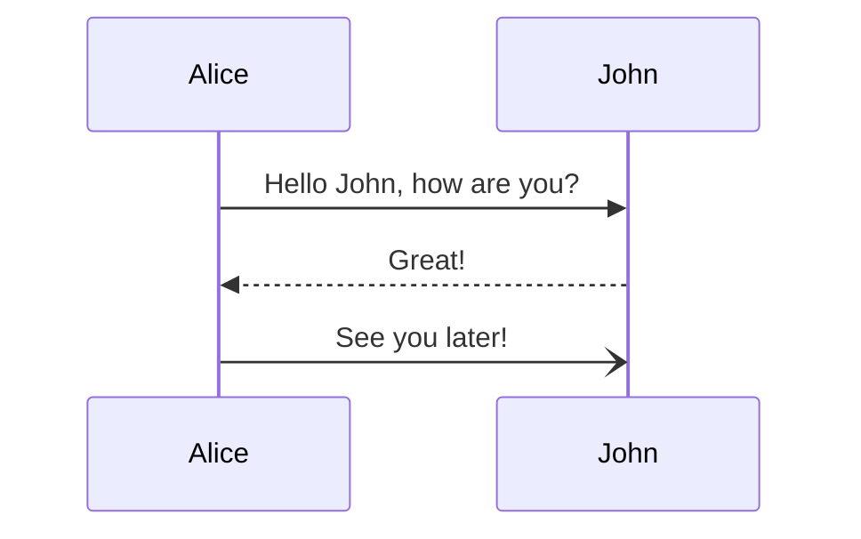

# team-shark-rw

- Road Warrior è un agglomerato di prenotazioni
- Fetch/inserimento delle informazioni di voli, hotel e noleggio veicoli (prenotazioni)
- Prenotazioni organizzate in viaggi (todo, doing, done)
- Condivisione viaggio interna (altri utenti) ed esterna (social)
- Reportistica per l'utente e analitica per Road Warrior
- Supporto online: redirigere alla agenzia della prenotazione oppure inserita a scelta

---

## Microservizi

## Entità

```
Booking(
    service: 'flight' | 'hotel' | 'car'
    startDateTime: date
    endDateTime: date
    bookingCode: string
    // altre cose del booking
    agency: Agency | null
    company: Company
    price: Money
    owner: User
)

Trip(
    startDate: date
    endDate: date
    bookings: Booking[]
    name: string
    owner: User
    partecipants: User[]
)

Agency(
    name: string
    phone: string
    email: string
    notes: string
    address: string
    web: string
)

Company(
    id: uuid,
    name: string,
    phone: string
    email: string
    notes: string
    address: string
    web: string
    service: 'flight' | 'hotel' | 'car'
)

User(
    name: string
    email: string
    // tokens
    // eventualmente password
)
```

