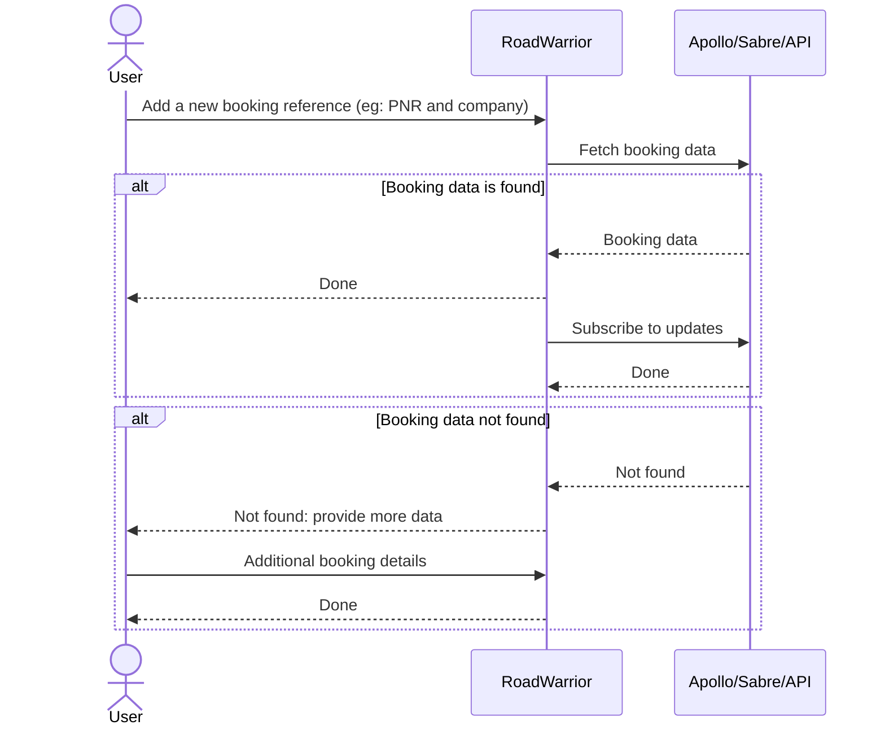
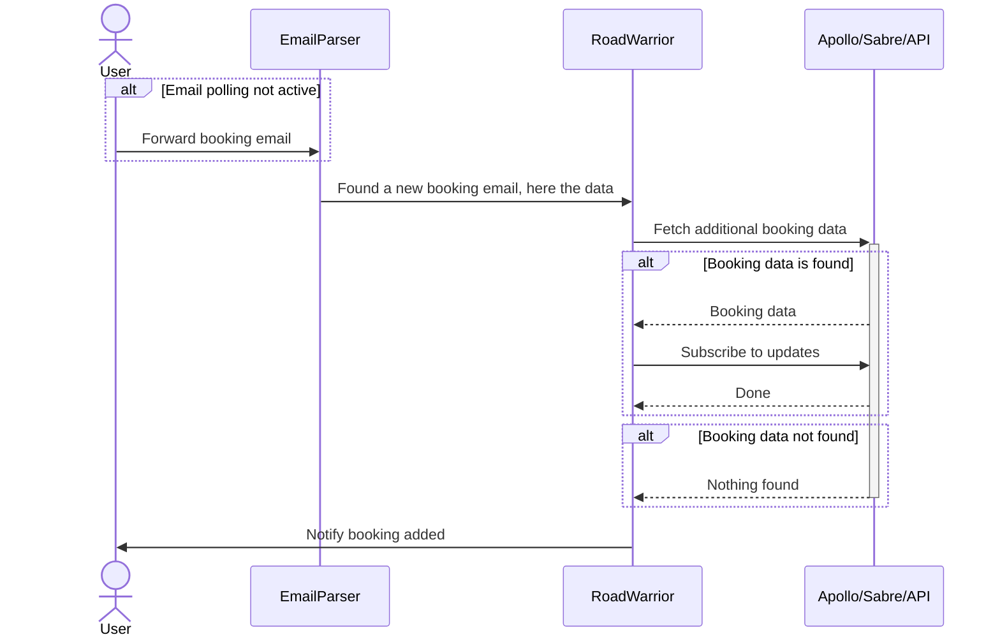
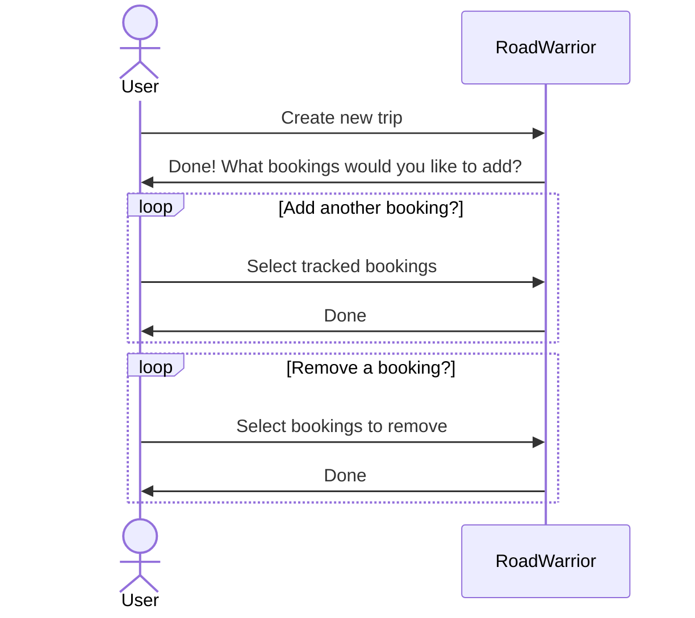
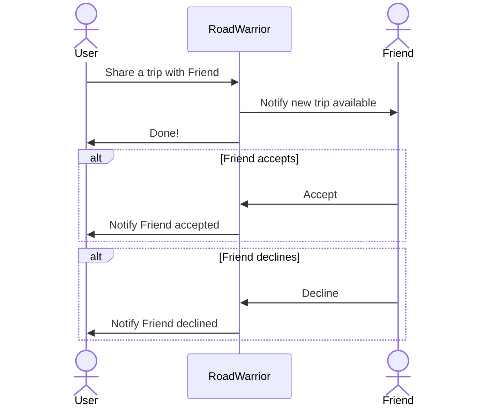
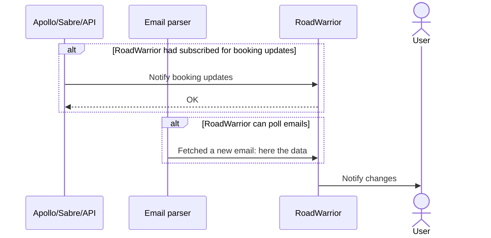
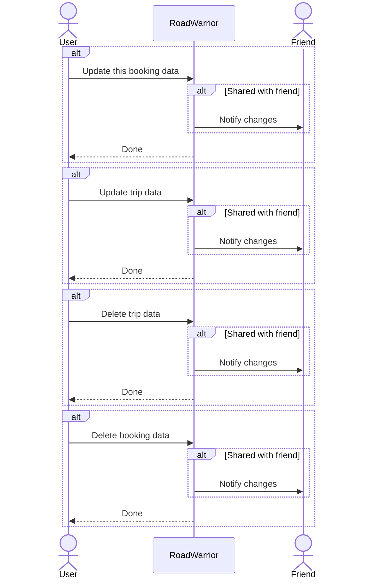

## Add a booking

```mermaid
sequenceDiagram
    actor U as User
    participant S as RoadWarrior
    participant E as Apollo/Sabre/API

    U ->> S: Add a new booking reference (eg: PNR and company)
    S ->> E: Fetch booking data

    alt Booking data is found
        E -->> S: Booking data
        S -->> U: Done
        S ->> E: Subscribe to updates
        E -->> S: Done
    end

    alt Booking data not found
        E -->> S: Not found
        S -->> U: Not found: provide more data
        U ->> S: Additional booking details
        S -->> U: Done
    end
```

```mermaid
sequenceDiagram
    actor U as User
    participant F as EmailParser
    participant S as RoadWarrior
    participant E as Apollo/Sabre/API

    alt Email polling not active
        U ->> F: Forward booking email 
    end

    F ->> S: Found a new booking email, here the data
    S ->>+ E: Fetch additional booking data

    alt Booking data is found
        E -->> S: Booking data
        S ->> E: Subscribe to updates
        E -->> S: Done
    end

    alt Booking data not found
        E -->>- S: Nothing found
    end

    S ->> U: Notify booking added
```

## Add a trip

```mermaid
sequenceDiagram
    actor U as User
    participant S as RoadWarrior
    
    U ->> S: Create new trip
    S ->> U: Done! What bookings would you like to add?

    loop Add another booking?

        U ->> S: Select tracked bookings
        S ->> U: Done

    end

    loop Remove a booking?

        U ->> S: Select bookings to remove
        S ->> U: Done

    end
```

## Share a trip

```mermaid
sequenceDiagram
    actor U as User
    participant S as RoadWarrior
    actor F as Friend
    
    U ->> S: Share a trip with Friend
    S ->> F: Notify new trip available
    S ->> U: Done!

    alt Friend accepts
        F ->> S: Accept
        S ->> U: Notify Friend accepted
    end

    alt Friend declines
        F ->> S: Decline
        S ->> U: Notify Friend declined
    end
```

## Handle booking update

```mermaid
sequenceDiagram
    participant E as Apollo/Sabre/API
    participant F as Email parser
    participant S as RoadWarrior
    actor U as User

    alt RoadWarrior had subscribed for booking updates 
        E ->> S: Notify booking updates
        S -->> E: OK
    end

    alt RoadWarrior can poll emails
        F ->> S: Fetched a new email: here the data
    end

    S ->> U: Notify changes
```

## Manual update/delete 

```mermaid
sequenceDiagram
    actor U as User
    participant S as RoadWarrior
    actor F as Friend

    alt
        U ->> S: Update this booking data
        alt Shared with friend
            S ->> F: Notify changes
        end
        S -->> U: Done
    end

    alt
        U ->> S: Update trip data
        alt Shared with friend
            S ->> F: Notify changes
        end
        S -->> U: Done
    end

    alt
        U ->> S: Delete trip data
        alt Shared with friend
            S ->> F: Notify changes
        end
        S -->> U: Done
    end

    alt
        U ->> S: Delete booking data
        alt Shared with friend
            S ->> F: Notify changes
        end
        S -->> U: Done
    end
```

## Richieste di supporto e scelta agenzia

TODO 

